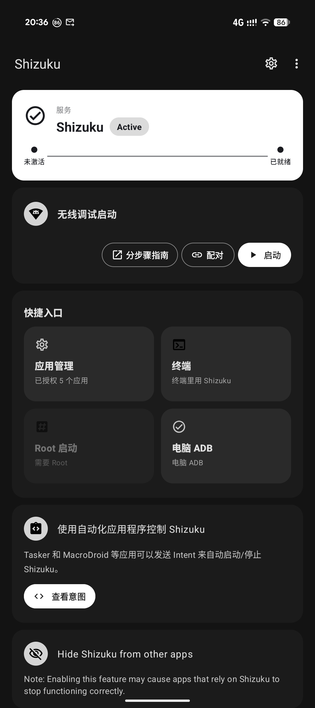

<div align="center">

# ✨ Shizuku · asrtroh 修缮版

**配对一次 · 旧 Wi‑Fi 自动连 · 开机 FGS 内激活 · V15.0 Hero**

基于 [thedjchi/Shizuku](https://github.com/thedjchi/Shizuku) 的合规衍生版  
**本仓只做 Shizuku 管理端** —— IMS 请看旁边的 [OneIms](https://github.com/asrtroh-netizen/OneIms) 哦～

[⬇️ Download](#-下载--download) · [🛠️ Changes](#-本分叉改动--whats-new) · [👨‍👩‍👧 Sister apps](#-同门产品--来串个门) · [🙏 Credits](#-致谢必读--credits)

<br/>



| Tag | Note |
|:---:|:---|
| `V15.0` | versionName |
| `moe.shizuku.privileged.api` | package（与官方同系，冲突需先卸载） |
| Apache-2.0 | license |

</div>

---

## 🙏 致谢（必读） · Credits

> 核心能力来自 **[RikkaApps/Shizuku](https://github.com/RikkaApps/Shizuku)** 与 **[thedjchi/Shizuku](https://github.com/thedjchi/Shizuku)**。  
> 本仓只是站在巨人肩膀上拧了几颗螺丝——**别把功劳算错人啦** 🙈  
> Full attribution: [ATTRIBUTION.md](./ATTRIBUTION.md) · [NOTICE](./NOTICE)  
> Upstream: [RikkaApps/Shizuku](https://github.com/RikkaApps/Shizuku)

---

## 🛠️ 本分叉改动 · What's New

### 中文

| 改动 | 说明 |
|---|---|
| 🚀 **开机自启（FGS 内激活）** | 对齐 OneKuku：在开机前台服务里完成无线 ADB 激活，不再只把任务丢给易被 OEM 冻结的 WorkManager |
| 📶 **配对一次 → 能连就自动连** | 有 ADB 密钥 + `WRITE_SECURE_SETTINGS` 后，旧 Wi‑Fi / 晚到网络会自动拉起 |
| 🎯 **Hero 二态** | 未激活 / **Shizuku + Active**；去掉与下方「启动」重复的激活按钮；去掉「休眠」态 |
| 🔲 **快捷入口四格** | 应用管理 · 终端 · Root · 电脑 ADB，等宽常显 |
| 📡 **TcpIp / TCP mode** | 保留 |
| 🎨 **UI** | Material 蓝系 + 圆角卡片；**不绑定任何 IMS 产品名**；已移除 Buy me a coffee |

> 💡 建议在设置里为 Shizuku **关闭电池优化**，开机自启更稳。

### English

| Change | Summary |
|---|---|
| 🚀 **Boot autostart (in-FGS)** | Activate wireless ADB **inside** the boot foreground service (OneKuku-style), not WorkManager-only |
| 📶 **Pair once, auto-connect** | With ADB key + `WRITE_SECURE_SETTINGS`, reconnect on remembered / late Wi‑Fi without an extra tap |
| 🎯 **Hero UI** | Inactive / **Shizuku + Active**; remove duplicate activate CTA; no “Sleeping” state |
| 🔲 **Four quick tiles** | Apps · Terminal · Root · PC ADB |
| 📡 **TcpIp / TCP mode** | Kept |
| 🎨 **UI** | Material blue tweaks; no IMS branding; no Buy-me-a-coffee |

> 💡 Disable battery optimization for Shizuku for reliable boot start.

---

## ⬇️ 下载 · Download

<div align="center">

### 👉 [Releases · V15.0](https://github.com/asrtroh-netizen/shizuku/releases)

| Flavor | File | For |
|---|---|---|
| 💎 **Release（推荐 / recommended）** | `shizuku-V15.0-release.apk` | Daily use · smaller · release signing |

</div>

> ⚠️ Uninstall conflicting same-package Shizuku first.  
> ⚠️ Release and Debug use **different signing keys** — you cannot overlay-install across flavors.

---

## 👨‍👩‍👧 同门产品 · 来串个门

> Public sister projects. Separate repos.

<table>
<tr>
<td width="50%" valign="top">

### 📱 [OneIms](https://github.com/asrtroh-netizen/OneIms)

**让 Pixel 和运营商重新学会沟通。**

Pixel IMS helper — VoLTE · VoWiFi · VoNR · signal bars · CarrierConfig…

- 🟢 **OneKuku**：App 内一键配对  
- 🔵 **OneIms Lite**：搭配 **本仓 Shizuku** 的轻壳（推荐）

📦 [OneIms Releases](https://github.com/asrtroh-netizen/OneIms/releases)  
💬 [Telegram · OneBoardX](https://t.me/OneBoardX)

</td>
<td width="50%" valign="top">

### 🎛️ [OneBoard](https://github.com/asrtroh-netizen/oneboard)

Native Compose console for your onebord gateway (`:8866`).

📦 [asrtroh-netizen/oneboard](https://github.com/asrtroh-netizen/oneboard)

</td>
</tr>
</table>

```text
        ┌─────────────┐     privilege      ┌──────────────────┐
        │   OneIms    │ ─────────────────► │  Shizuku (this)  │
        │ Lite line   │                    │  boot-autostart  │
        └─────────────┘                    └──────────────────┘
```

Tip: with **OneIms Lite**, keep this Shizuku **Active** — authorize once, no re-pair every day ✨

---

## 🏗️ 构建 · Build

```bash
git clone --recurse-submodules https://github.com/asrtroh-netizen/shizuku.git
cd shizuku
# local.properties → sdk.dir
./gradlew :manager:assembleRelease   # needs signing.properties
```

---

## 📜 License

- Main: **Apache-2.0** ([LICENSE](./LICENSE))
- API subtree: **MIT** (`api/LICENSE`)

Keep `NOTICE`, `ATTRIBUTION.md`, and `LICENSE` when redistributing.

---

<div align="center">

**Made with caffeine & stubbornness · by [asrtroh-netizen](https://github.com/asrtroh-netizen)**

Also ⭐ [RikkaApps/Shizuku](https://github.com/RikkaApps/Shizuku) — the real upstream!

</div>
